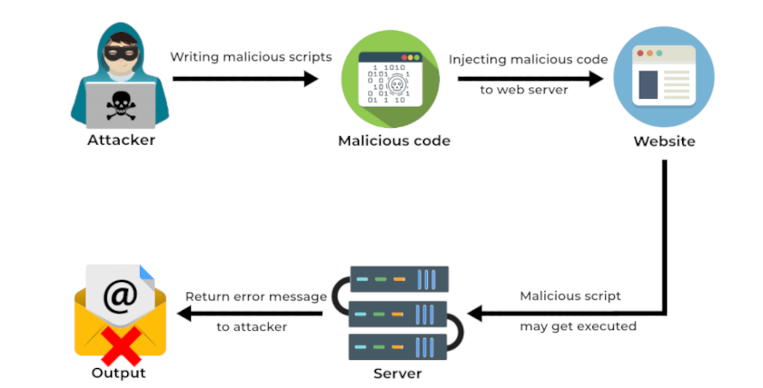

<br/>
<p align="center">
  <a href="https://github.com/errorfiathck">
    
  </a>

  <h3 align="center">‌rce affirmator</h3>

  <p align="center">
    an exploit of rce Vulnerability
    <br/>
    Note this project is not done...
    <br/>
    <br/>
    <!-- <a href="https://readme.shaankhan.dev"><strong>View Demo »</strong></a> -->
    <br/>
    <br/>
    <a href="https://intsagram.com/error._.fiat">Our instagram page</a>
    .
    <a href="https://youtube.com/error_fiat">Our youtube chanel</a>
    .
    <a href="https://twitter.com/ErrorFiat">Our twitter page</a>
  </p>
</p>


## What is an RCE Vulnerability? and A short definition of RCE Vulnerability

A remote code execution (RCE) vulnerability is a bug that threat actors can exploit by injecting a user input into a file or string meant to be executed by the target program’s parser. The web application’s developer, of course, did not intend his/her creation to do what the attacker aims to.

An RCE vulnerability allows attackers to compromise the vulnerable web application and its server fully. Note that almost all programming languages have code execution functions, making the bug a critical issue.

## How Does an RCE Vulnerability Work?

The video above shows the steps the threat actors took to make an RCE vulnerability like Log4j. These are:

1. The attackers write the malicious script.
2. Once they have the malicious code, they inject the script into the target web application.
3. If the code gets logged, it will get executed by the webserver.
4. Once all is said and done, the threat actors receive an error message telling them they succeeded.

Here’s a diagram showing how a typical remote code execution vulnerability works:



## What Are the Goals of a Remote Code Execution Vulnerability Attack?

Attackers aim to ultimately control a target network by exploiting an RCE vulnerability. They abuse such a bug to:

- Gain initial access to the target server: RCE vulnerability attacks start by abusing a weakness in an Internet-connected application to allow the threat actors to run commands on the webserver. That allows them to install malware, steal data, or achieve other goals.
- Disclose information: Attackers exploit an RCE vulnerability to install data-stealing malware or directly execute commands to extract and exfiltrate data from the target device.
- Initiate a denial-of-service (DoS) attack: RCE vulnerability attacks let threat actors run malicious code on the system that hosts a vulnerable application. That would allow them to disrupt the target organization’s operations.
- Mine cryptocurrency: Attackers can install cryptomining or cryptojacking malware on devices vulnerable to an RCE vulnerability. If the attack succeeds, the threat actors can use the computational resources of compromised systems to mine cryptocurrency.
- Install ransomware: This scenario was evident in the WannaCry attack back in 2017. Attackers exploited an RCE vulnerability to install WannaCry into target devices, thus denying users access to their files until they pay the ransom.


## What Are Infamous Examples of Remote Code Execution Vulnerabilities?

We’ve seen many RCE vulnerability attacks over time. While not all of them succeed, two so far have become infamous. These are:

- Log4j: Threat actors exploited this popular Java logging library that many Internet services and applications use in December 2021. They executed cryptojackers and other malware on compromised servers. Users worldwide suffered, with some even losing all their money saved in banks.
- Eternal Blue: The Eternal Blue exploit instigated WannaCry attacks in 2017. The RCE vulnerability attackers exploited allowed them to execute WannaCry, encrypting affected users’ valuable files. The campaign infected 200,000 computers across 150 countries, causing victims an estimated loss of US$4 billion.

## How Can Users Prevent an RCE Vulnerability Exploitation?

While threat actors can exploit several RCE vulnerabilities, making it difficult to protect against them, some best practices can still work, such as:

- Sanitize inputs: RCE vulnerability attackers often inject malicious inputs to get into target systems. As such, validating user inputs before any application runs them would help prevent several RCE vulnerability attacks.
- Secure memory management: RCE vulnerability attackers often cause buffer overflows by flooding a target application with so many requests until it fails. That said, users should scan for vulnerabilities regularly and fix these errors.
- Inspect traffic: Screening traffic, especially that going to vulnerable applications, can also prevent the exploitation of an RCE vulnerability. Deploying network security solutions that can block malicious traffic and detect remote control may thus be helpful.
- Control user access: Even if RCE vulnerability attacks succeed, threat actors can’t move throughout a target network and achieve their final goal if users segment their network, manage user access better, and employ a zero-trust security strategy.

—

RCE vulnerability attacks are, as you’ve seen, very destructive but preventing them is possible by following the best practices cited above.

## About The Project


an rce Vulnerability finder or affirmator

## Built With

Whilst I was the main developer of this project, this project couldn't of even started without the help of these open source projects, special thanks to:

- [[Python]](https://www.python.org/)

## Getting Started

This is an example of how you may give instructions on setting up your project locally.
To get a local copy up and running follow these simple example steps.

### Prerequisites

This program has no pre-requisites

### Installation & Usage

1. Clone the repo

```sh
git clone https://github.com/errorfiathck/rce-affirmator.git
```

2. cd to directory

```sh
cd rce-affirmator
```
3. run the script as example:
```sh
python3 rce-affirmator.py -u https://ip-target -c 'id'
python3 rce-affirmator.py -f targets-ip.txt
```

4. Have fun!
